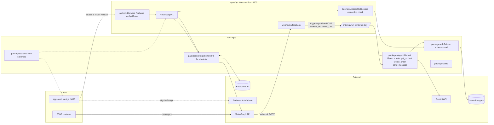
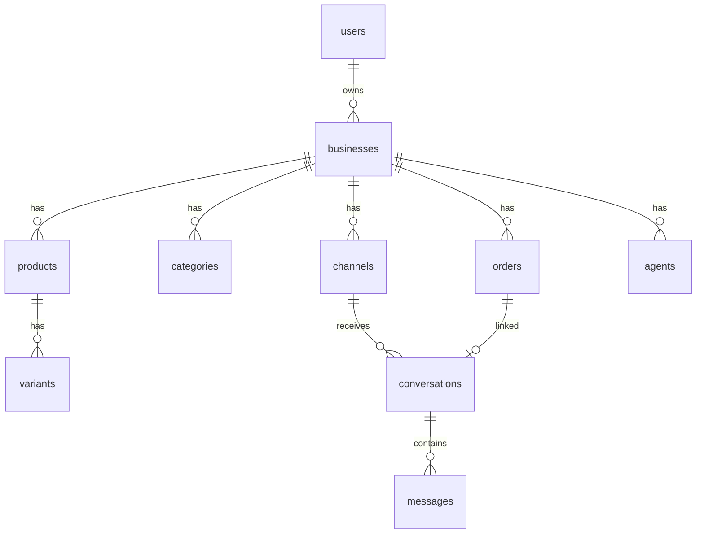

# Oryxa — Architecture Report

Generated: 2026-10-01

## 1. Overview

Oryxa is a Bun-workspaces monorepo: a multi-tenant commerce + AI-agent platform.
Vendors ("businesses") manage products/orders on a Next.js dashboard, while an
AI agent (Gemini) answers customers over Facebook/Instagram via webhooks.

| Layer | Tech |
|---|---|
| Web client | Next.js 15 App Router, React Query, Firebase Web SDK |
| API | Hono + `@hono/zod-openapi` on Bun (`apps/api`) |
| Contracts | `packages/shared` — Zod/OpenAPI schemas, single source of truth |
| Database | Drizzle ORM + Neon (serverless Postgres) |
| Storage | Backblaze B2 (S3-compatible) via AWS SDK |
| AI agent | LangChain/LangGraph ReAct agent on Gemini (`gemini-2.5-flash-lite`) |
| Integrations | Meta/Facebook Graph v21 (OAuth, pages, send, webhooks) |
| Hosting | Vercel (projects `oryxa-web`, `oryxa-api2`) |

## 2. System graph



## 3. Workspace layout

```
apps/api          Hono API (src/bunServe.ts local, api/index.ts Vercel handler)
apps/web          Next.js dashboard (app/, components/, lib/)
packages/shared   schemas: base, user, business, product, order, channel, conversation
packages/db       schema.ts, client.ts (Neon), crud/*, migrations/0000_init.sql
packages/agent    Agent.ts (Gemini), tools/index.ts
packages/integrations  b2.ts (S3 put/presign), facebook.ts (Graph v21)
packages/utils    slugify, parseNumeric
drizzle.config.ts (root) -> packages/db/schema.ts
```

## 4. API surface & auth flow

Routes mounted in `apps/api/src/app.ts`:
`/api/v1/users` (public `POST /users/sync`), `/api/v1/businesses`,
`/api/v1/{businessId}/products|orders|channels|conversations|uploads`,
`/webhooks/facebook`, `/internal/run`, `/doc` (OpenAPI UI).

Auth (`src/middleware/auth.ts`): Bearer token -> `firebase-admin.verifyIdToken`
-> lookup user by Firebase UID -> `businessAccessMiddleware` verifies the
`businessId` belongs to the caller. Dev bypass token: `dev-test-token`.

Internal agent runner (`src/routes/internal/run.ts`): guarded by
`x-internal-key == INTERNAL_KEY`, fire-and-forget via `waitUntil`.

## 5. Database model (current)



Tables (`packages/db/schema.ts`): `users`, `businesses`, `categories`,
`products`, `variants`, `orders`, `agents`, `channels`, `conversations`,
`messages`. Enums: `order_state`, `platform`, `message_from`, `message_state`.

Customer data today is denormalized only: `conversations.customer_platform_id /
customer_name / customer_avatar`, `orders.customer_name / avatar / address /
phone`. Variants store the B2 object key in `image_url`.

## 6. Key flows

- **Product CRUD** — dashboard -> `/api/v1/{businessId}/products` ->
  `crud/product.ts`: slugify name, auto-create category from `categoryName`,
  variant diff on update (note: N+1 writes, no transaction).
- **Image upload** — `src/routes/uploads.ts` multipart -> `uploadImageToB2`,
  key `businesses/{id}/images/{uuid}-{name}`; reads via presigned GET
  (`assertB2KeyForBusiness` guards cross-tenant signing).
- **Facebook conversation** — webhook GET verify token handshake; POST ->
  `getChannelByPageId` -> `processInboundMessage` -> `triggerAgentRun` ->
  `POST {AGENT_RUNNER_URL}/internal/run` -> agent loads history + top-10
  catalog -> Gemini -> tools `get_product` / `create_order` / `send_message`
  -> reply via Graph API. `verifyWebhookSignature` is a stub (returns true)
  and is not called — Meta signature verification is not enforced.
- **Web auth** — `components/auth-provider.tsx`: `onAuthStateChanged` ->
  `getIdToken` -> `POST /users/sync` -> all API calls with Bearer token.

## 7. Environment files

| File | Read by | Contents |
|---|---|---|
| `/workspaces/Oryxa/.env` (root) | `apps/api` dev/start via `bun --env-file=../../.env` | api2 (Vercel `oryxa-api2`) pull: DB, Firebase Admin, B2, META_APP_ID/SECRET + secret, AZURE_API_KEY, INTERNAL_KEY, ports |
| `apps/web/.env.local` | Next.js (highest precedence, overrides `apps/web/.env`) | web (Vercel `oryxa-web`) pull: NEXT_PUBLIC_* Firebase/API, ports |
| `.env.example` (tracked) | template only — placeholders, no secrets | — |

All env files match `.gitignore` (`**/.env*`); secrets are never committed.
Local ports: API 3500, Web 3400.

## 8. Gaps / notes for the planned "company + customer products" feature

- No `companies` or `customers` tables exist; `businesses` is the only tenant.
- `products` links to `business_id` only — a customer/company attribution
  requires a new `customers` table + FK on products (or repurposing businesses).
- Product CRUD is non-transactional — worth wrapping in a transaction when the
  feature adds related writes.

## 9. Public exposure — Cloudflare Tunnel

`cloudflared` is installed (`~/.local/bin/cloudflared`, v2026.9.3).

```bash
# Quick tunnel, no account needed (URL changes each run):
cloudflared tunnel --url http://localhost:3500   # API (for Meta webhook testing)
cloudflared tunnel --url http://localhost:3400   # Web dashboard
```

Note for remote visitors: `NEXT_PUBLIC_API_URL` points at
`http://localhost:3500`, which only resolves on your machine. A remote browser
loading the tunneled web app cannot reach the API until the web app is rebuilt
with the API's public tunnel URL. For a stable domain use a named tunnel
(`cloudflared tunnel login && cloudflared tunnel create ...`).
