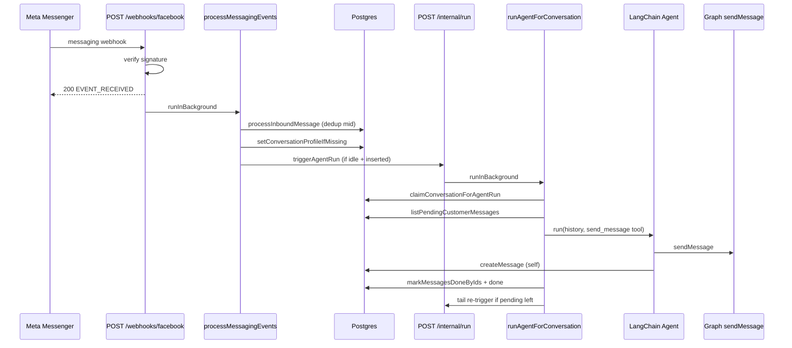
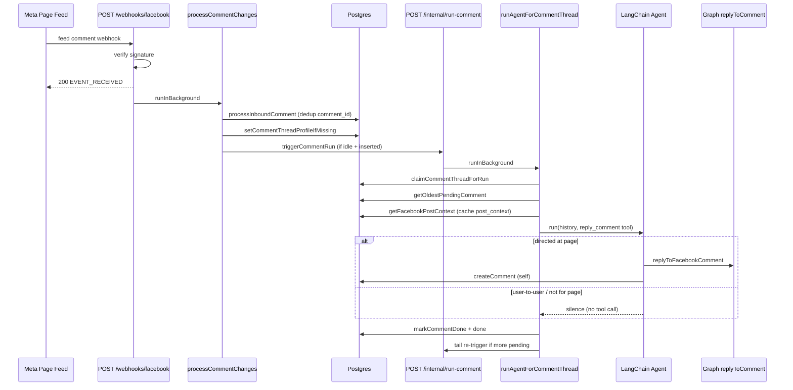

# Oryxa

Multi-channel AI auto-reply SaaS for e-commerce. MVP: Facebook Messenger + Gemini agent + product catalog + orders.

## Stack

- **Monorepo:** Bun workspaces
- **API:** Hono + OpenAPI + Drizzle + Postgres
- **Web:** Next.js 15 + Tailwind + Firebase Auth (Google)
- **AI:** LangChain + Google Gemini 2.5 Flash-Lite
- **Files:** Backblaze B2 (S3-compatible API)

## Quick Start

### 1. Prerequisites

- [Bun](https://bun.sh) 1.2+
- Postgres ([Neon](https://neon.tech) recommended)
- Firebase project with Google sign-in
- Meta Developer app (Messenger)
- Google AI Studio API key (Gemini)
- Backblaze B2 bucket + application key (S3-compatible)

### 2. Environment

```bash
cp .env.example .env
# Fill in all values
```

### 3. Install & database

```bash
bun install
bun run db:push
```

### 4. Run locally

```bash
# Terminal 1 — API (port 3001)
bun run dev:api

# Terminal 2 — Web (port 3400)
bun run dev:web
```

Open http://localhost:3400

### API via Next.js (`api2`)

Hono’s [Next.js integration](https://hono.dev/docs/getting-started/nextjs) mounts the shared `api` app with `handle()` from `hono/vercel` on App Router route handlers:

```bash
# apps/api2/.env.local → ../../.env (symlink; same secrets as API)
bun run dev:api2   # http://localhost:3500
```

If the web app should call **api2** instead of standalone `api`, set `NEXT_PUBLIC_API_URL` and `AGENT_RUNNER_URL` to the api2 URL (e.g. `http://localhost:3500`).

Routes: `/`, `/api/v1/*`, `/doc`, `/ui`, `/webhooks/*`, `/internal/*` — all served from `import { app } from '@repo/api/app'`.

### Build

```bash
# API only
bun run build:api

# Web only (Next.js production build)
bun run build:web

# Both apps
bun run build
```

Production start (after build):

```bash
bun run start:api   # API on API_PORT (default 3001)
bun run start:web   # Next.js on WEB_PORT (default 3400)
```

### API via Vercel CLI (local serverless simulation)

From repo root (requires [Vercel CLI](https://vercel.com/docs/cli)):

```bash
# One-time: symlink env into apps/api (gitignored)
ln -sf ../../.env apps/api/.env.local

bun run dev:api:vercel
```

Runs on http://localhost:3001 using `apps/api/api/index.ts` (Hono + `vercel dev`). For Bun hot reload locally use `bun run dev:api` (`src/bunServe.ts`).

If install fails with `Unsupported package manager specification`, ensure root `package.json` has **no** `packageManager` field — Vercel detects Bun from `bun.lock` instead.

### 5. Meta webhook (after deploy)

Set webhook URL to `https://your-api.vercel.app/webhooks/facebook` with verify token from `META_VERIFY_TOKEN`.

## Project structure

```
apps/api/          Hono API, webhooks, internal agent runner
apps/web/          Next.js dashboard
packages/db/       Drizzle schema + CRUD
packages/shared/   Zod schemas (single source of truth)
packages/agent/    LangChain + Gemini tools
packages/integrations/  Facebook OAuth + Send API
```

### Internal path aliases

Each package defines its own TypeScript `paths` so you avoid `../../` imports:

| Package | Alias | Example |
|---------|-------|---------|
| `packages/db` | `@db/*` | `import { db } from '@db/client'` |
| `packages/shared` | `@shared/*` | `import { uuidSchema } from '@shared/schemas/base'` |
| `packages/agent` | `@agent/*` | `import { Agent } from '@agent/Agent'` |
| `apps/api` | `@api/*` | `import { authMiddleware } from '@api/middleware/auth'` |
| `apps/web` | `@/*` | `import { Button } from '@/components/ui/button'` |

Cross-package imports still use workspace names: `@repo/db`, `@repo/shared`, etc.

Aliases are configured in each package's `tsconfig.json`. Bun resolves them at runtime; Vitest uses matching aliases in `vitest.config.ts`.

## Scripts

| Command | Description |
|---------|-------------|
| `bun run dev:api` | Start API server |
| `bun run dev:web` | Start Next.js app |
| `bun run db:push` | Push schema to Postgres |
| `bun run db:studio` | Open Drizzle Studio |
| `bun test` | Run Vitest suite (PGlite in-memory DB) |
| `bun run test:coverage` | Run tests with coverage report |
| `bun run test:neon` | Optional: run all Neon integration tests (`DATABASE_URL` or `NEON_DATABASE_URL` with a Neon URL) |
| `bun run test:neon:crud` | Optional: run only Neon CRUD tests (36 tests across all entities) |
| `bun run gen:api` | Generate React Query client from OpenAPI |

## Deploy (Vercel)

Two separate Vercel projects from the same Git repo.

### API project (`oryxa-api`)

| Setting | Value |
|---------|--------|
| **Root Directory** | `apps/api` |
| **Framework Preset** | Other |
| **Install Command** | `cd ../.. && bun install` |
| **Build Command** | `cd ../.. && bun install && bun --filter @repo/api build` |
| **Output Directory** | *(leave empty — Vercel handler is `public/index.js`)* |
| **Node.js Version** | 20.x |

The serverless entry re-exports `src/index.ts` (`export default handle(app)`). Local dev uses `src/bunServe.ts`. `bun run build:api` bundles TypeScript to:

- `apps/api/public/index.js` — Vercel serverless handler (`handle(app)`)
- `apps/api/public/server/index.js` — standalone Bun server (`bun run start:api`)

Source for the Vercel bundle is `api/index.ts` (re-exports `src/index.ts`). No copy step — deploy uses `public/index.js` directly.

**Production URLs to set in env:**

- `WEB_URL` → your web app URL (e.g. `https://oryxa-web.vercel.app`)
- `AGENT_RUNNER_URL` → this API URL (e.g. `https://oryxa-api.vercel.app`)
- `META_REDIRECT_URI` → `https://oryxa-api.vercel.app/api/v1/auth/facebook/callback`

Copy every other variable from `.env.example` into the Vercel project **Environment Variables** (Production + Preview).

For `FIREBASE_PRIVATE_KEY`, paste the key with real newlines, or use `\n` escapes — Vercel accepts both if the API reads it correctly.

**Meta webhook:** `https://oryxa-api.vercel.app/webhooks/facebook`

**Smoke test after deploy:**

```bash
curl https://your-api.vercel.app/
curl https://your-api.vercel.app/doc
```

### Web project (`oryxa-web`)

| Setting | Value |
|---------|--------|
| **Root Directory** | `apps/web` |
| **Framework Preset** | Next.js |
| **Install Command** | `cd ../.. && bun install` |
| **Build Command** | `cd ../.. && bun --filter web build` |

Set `NEXT_PUBLIC_API_URL` to the API Vercel URL. Other `NEXT_PUBLIC_FIREBASE_*` vars from Firebase console.

`apps/web/vercel.json` already mirrors these commands.

## External setup guides

1. **Neon:** Create project → copy pooled connection string → `DATABASE_URL`
2. **Firebase:** Enable Google provider → add web app credentials → create service account for API
3. **Meta:** Create app → add Messenger → connect test Page → set OAuth redirect to `/api/v1/auth/facebook/callback`
4. **Gemini:** https://aistudio.google.com/apikey → `GEMINI_API_KEY`
5. **Backblaze B2:** Create private bucket → application key → set `B2_*` env vars. Images use **presigned URLs** (no public bucket needed). See [B2 S3 API docs](https://www.backblaze.com/docs/cloud-storage-s3-compatible-api)

   ### B2 bucket CORS (required for direct browser uploads)

   Variant images are uploaded **straight from the browser to B2** via a presigned `PUT` URL (see `apps/web/lib/uploads-client.ts`), and displayed via presigned `GET` URLs. Both are cross-origin requests from the web app, so the bucket must have CORS rules that explicitly allow them. Without a `PUT` rule the browser blocks the upload with a generic `TypeError: Failed to fetch` (the sign step succeeds, but the PUT is rejected at the CORS preflight).

   B2 CORS rules map S3-style operations to B2 operations. The operations this app needs:

   | Operation        | Used for                                              |
   |------------------|-------------------------------------------------------|
   | `s3_get`         | Browser fetches presigned GET URLs to display images |
   | `s3_head`        | Browser HEAD checks on presigned GET URLs            |
   | `s3_put`         | Browser PUTs bytes to the presigned upload URL       |
   | `b2_download_file_by_id`, `b2_download_file_by_name` | Native B2 downloads (optional, kept for compatibility) |

   #### Rules needed

   **Download from any origin** (`s3_get` + `s3_head` from `*`):

   ```json
   {
     "corsRuleName": "s3DownloadFromAnyOrigin",
     "allowedOrigins": ["*"],
     "allowedOperations": ["s3_get", "s3_head"],
     "allowedHeaders": ["authorization", "range"],
     "exposeHeaders": [],
     "maxAgeSeconds": 3600
   }
   ```

   **PUT from any origin** (`s3_put` from `*` — required for direct browser uploads):

   ```json
   {
     "corsRuleName": "s3PutFromAnyOrigin",
     "allowedOrigins": ["*"],
     "allowedOperations": ["s3_put"],
     "allowedHeaders": ["content-type", "x-amz-content-sha256", "x-amz-date", "authorization"],
     "exposeHeaders": ["etag", "x-amz-request-id"],
     "maxAgeSeconds": 3600
   }
   ```

   > **Production hardening:** replace `"*"` in `allowedOrigins` with your exact web origin(s) (e.g. `https://oryxa-web.vercel.app`, plus `http://localhost:3400` for local dev). Using `*` is convenient for GitHub Codespaces (whose `*.app.github.dev` URLs change per session) but allows any site to issue authenticated PUTs against presigned URLs — presigned URLs are short-lived (5 min) and content-type-bound, so the risk is limited, but locking the origin is best practice.

   #### How to update CORS

   You can set CORS either from the **B2 web dashboard** or with the **B2 native API** via curl. The API approach is scriptable and is what was used to configure this project's bucket.

   ##### Option A — B2 web dashboard

   1. Sign in to https://secure.backblazeb2.com → **B2 Cloud Storage** → find your bucket (`B2_BUCKET_NAME`).
   2. Open the bucket → **Bucket Settings** → **CORS Rules** → **Edit**.
   3. Paste the rules from above (as a JSON array under `corsRules`) and save.

   ##### Option B — B2 native API (curl)

   The credentials come from your `.env` (`B2_KEY_ID`, `B2_APPLICATION_KEY`, `B2_BUCKET_NAME`). The flow is: `b2_authorize_account` → `b2_list_buckets` (to get the `bucketId`) → `b2_update_bucket` (to set the full `corsRules` array).

   ```bash
   set -a && . .env && set +a

   # 1. Authorize — get apiUrl, authorizationToken, accountId
   AUTH=$(curl -s -u "$B2_KEY_ID:$B2_APPLICATION_KEY" \
     https://api.backblazeb2.com/b2api/v3/b2_authorize_account)
   API_URL=$(echo "$AUTH" | python3 -c "import sys,json;print(json.load(sys.stdin)['apiInfo']['storageApi']['apiUrl'])")
   TOKEN=$(echo "$AUTH"   | python3 -c "import sys,json;print(json.load(sys.stdin)['authorizationToken'])")
   ACCT=$(echo "$AUTH"    | python3 -c "import sys,json;print(json.load(sys.stdin)['accountId'])")

   # 2. Look up the bucketId for B2_BUCKET_NAME
   BUCKET_ID=$(curl -s -X POST "$API_URL/b2api/v3/b2_list_buckets" \
     -H "Authorization: $TOKEN" \
     -d "{\"accountId\":\"$ACCT\",\"bucketName\":\"$B2_BUCKET_NAME\"}" \
     | python3 -c "import sys,json;print(json.load(sys.stdin)['buckets'][0]['bucketId'])")

   # 3. Update CORS — send the COMPLETE corsRules array (this replaces all rules)
   curl -s -X POST "$API_URL/b2api/v3/b2_update_bucket" \
     -H "Authorization: $TOKEN" \
     -d '{
       "accountId": "'"$ACCT"'",
       "bucketId": "'"$BUCKET_ID"'",
       "bucketType": "allPrivate",
       "corsRules": [
         {
           "corsRuleName": "downloadFromAnyOrigin",
           "allowedOrigins": ["*"],
           "allowedOperations": ["b2_download_file_by_id", "b2_download_file_by_name"],
           "allowedHeaders": ["authorization", "range"],
           "exposeHeaders": null,
           "maxAgeSeconds": 3600
         },
         {
           "corsRuleName": "s3DownloadFromAnyOrigin",
           "allowedOrigins": ["*"],
           "allowedOperations": ["s3_get", "s3_head"],
           "allowedHeaders": ["authorization", "range"],
           "exposeHeaders": null,
           "maxAgeSeconds": 3600
         },
         {
           "corsRuleName": "s3PutFromAnyOrigin",
           "allowedOrigins": ["*"],
           "allowedOperations": ["s3_put"],
           "allowedHeaders": ["content-type", "x-amz-content-sha256", "x-amz-date", "authorization"],
           "exposeHeaders": ["etag", "x-amz-request-id"],
           "maxAgeSeconds": 3600
         }
       ]
     }' | python3 -m json.tool
   ```

   ##### Verify the current CORS rules

   ```bash
   set -a && . .env && set +a
   AUTH=$(curl -s -u "$B2_KEY_ID:$B2_APPLICATION_KEY" https://api.backblazeb2.com/b2api/v3/b2_authorize_account)
   API_URL=$(echo "$AUTH" | python3 -c "import sys,json;print(json.load(sys.stdin)['apiInfo']['storageApi']['apiUrl'])")
   TOKEN=$(echo "$AUTH" | python3 -c "import sys,json;print(json.load(sys.stdin)['authorizationToken'])")
   ACCT=$(echo "$AUTH" | python3 -c "import sys,json;print(json.load(sys.stdin)['accountId'])")
   curl -s -X POST "$API_URL/b2api/v3/b2_list_buckets" \
     -H "Authorization: $TOKEN" \
     -d "{\"accountId\":\"$ACCT\",\"bucketName\":\"$B2_BUCKET_NAME\"}" \
     | python3 -c "import sys,json;b=json.load(sys.stdin)['buckets'][0];print(json.dumps(b.get('corsRules',[]),indent=2))"
   ```

   #### Notes

   - `b2_update_bucket` **replaces the entire `corsRules` array** — always send the full set of rules you want, including the existing download rules, or you will remove them.
   - `b2_update_bucket` requires `accountId`, `bucketId`, and `bucketType` (use `allPrivate` for a private bucket).
   - The presigned PUT URL's signature binds the `Content-Type` header, so a client cannot lie about the MIME type — B2 rejects mismatched PUTs with 403.
   - After changing CORS, browsers may cache the preflight result for up to `maxAgeSeconds`; if a PUT still fails right after a rule change, do a hard refresh or wait for the cache to expire.

## Architecture: Messenger messages & Facebook comments

Oryxa handles two **separate inbound domains** on the same Facebook Page channel. They share the webhook endpoint, security gates, background processing, channel/agent lookup, and the LangChain `Agent` class — but they use different tables, runners, outbound tools, and concurrency rules.

```
                         ┌─────────────────────────────────────────┐
                         │           Meta (Facebook)               │
                         │  Messenger DMs  │  Page feed comments   │
                         └────────┬───────────────┬────────────────┘
                                  │               │
                                  ▼               ▼
                    POST /webhooks/facebook  (same endpoint)
                    ├─ HMAC verify (META_APP_SECRET)
                    ├─ JSON parse + validate object=page
                    └─ 200 EVENT_RECEIVED immediately
                              │
                              ▼ runInBackground(processEntries)
                    ┌─────────────────────────────────────┐
                    │  For each entry.id (= page id):     │
                    │  getChannelByPageId → channel row   │
                    └──────────────┬──────────────────────┘
                                   │
              ┌────────────────────┴────────────────────┐
              ▼                                         ▼
    entry.messaging[]                          entry.changes[]
    (DM events)                                (feed / comments)
              │                                         │
              ▼                                         ▼
    conversations + messages                   comment_threads + comments
              │                                         │
              ▼                                         ▼
    POST /internal/run                         POST /internal/run-comment
              │                                         │
              ▼                                         ▼
    runAgentForConversation                    runAgentForCommentThread
              │                                         │
              ▼                                         ▼
    send_message tool → Messenger API          reply_comment tool → Graph /replies
```

### Data model

Both domains hang off the same `channels` row (one Facebook Page = one channel with `api_token` + `platform_channel_id` + optional `agent_id`).

| Domain | Container table | Key | Child table | Dedup key |
|--------|-----------------|-----|-------------|-----------|
| **Messenger** | `conversations` | `(channel_id, customer_platform_id)` — one DM thread per customer | `messages` | `messages.external_id` = Meta `mid` |
| **Comments** | `comment_threads` | `(channel_id, platform_item_id, commenter_platform_id)` — one thread per commenter per post | `comments` | `comments.external_id` = Meta `comment_id` |

**State machine** (both domains use the same enum: `pending` → `working` → `done`):

- Container: `conversations.last_message_state` / `comment_threads.last_comment_state`
- Child row: `messages.state` / `comments.state` (customer rows start `pending`; self rows start `done`)

**Profile & context columns:**

| Domain | Name | Avatar | Extra context |
|--------|------|--------|---------------|
| Messenger | `conversations.customer_name` | `conversations.customer_avatar` | — |
| Comments | `comment_threads.commenter_name` (from webhook) | `comment_threads.commenter_avatar` (Graph API) | `comment_threads.post_context` (post caption/attachment, cached once) |

### Shared webhook entry (`apps/api/src/webhooks/facebook.ts`)

Every inbound delivery — DM or comment — follows the same front door:

1. **`GET /webhooks/facebook`** — one-time subscription handshake (`hub.verify_token` must match `META_VERIFY_TOKEN`).
2. **`POST /webhooks/facebook`** — read **raw body** → verify `X-Hub-Signature-256` with `META_APP_SECRET` → parse JSON → require `object === 'page'` and `entry[]`.
3. **Ack fast** — return `200 EVENT_RECEIVED` immediately; call `runInBackground(c, processEntries(entry))` so Meta doesn't time out and retry the whole batch (see reliability #6).
4. **`processEntries`** — for each `entry`:
   - Look up `channel = getChannelByPageId(entry.id)` (the page id Meta sends). Unknown page → skip silently.
   - If `entry.messaging` → `processMessagingEvents(channel, …)`
   - If `entry.changes` → `processCommentChanges(channel, entry.id, …)`
   - A single batched POST can contain both; both branches run for the same page.

---

### Flow A: Messenger message (DM) — end to end

**Trigger:** customer sends a text message to the Page on Messenger.

**Webhook payload shape:**
```json
{
  "object": "page",
  "entry": [{
    "id": "<PAGE_ID>",
    "messaging": [{
      "sender": { "id": "<PSID>" },
      "message": { "mid": "<MID>", "text": "Do you have t-shirts?" }
    }]
  }]
}
```

**Step-by-step (background, after ack):**

| Step | Where | What happens |
|------|-------|--------------|
| 1 | `processMessagingEvents` | Skip if `message.is_echo` (bot's own reply echoed back). Skip if no `message.text` (attachments, read receipts, postbacks). |
| 2 | `processInboundMessage` | **Get-or-create** `conversations` row for `(channel_id, sender.id)`. Insert `messages` row: `from=customer`, `state=pending`, `external_id=mid` with **`ON CONFLICT DO NOTHING`** on `external_id`. Returns `{ conversationId, priorStatus, inserted, needsProfile }`. |
| 3 | Idempotency | If `inserted=false` (Meta retry of same `mid`) → stop; no agent trigger. |
| 4 | State update | If insert succeeded and conversation was `done` → set `last_message_state=pending`. If already `working`, **do not downgrade** (agent is mid-run). |
| 5 | Profile enrichment | If `needsProfile` (name or avatar still null): `getFacebookUserProfile(pageToken, psid)` → `setConversationProfileIfMissing` (writes each column only when NULL). Best-effort; retries on next inbound if Graph fails. |
| 6 | Trigger gate | If `inserted && priorStatus === 'done' && channel.agentId` → `triggerAgentRun(conversationId)` — fire-and-forget `POST /internal/run`. Messages arriving while conversation is already `pending`/`working` do **not** re-trigger here; the runner's tail re-trigger handles them. |
| 7 | `POST /internal/run` | Auth: `x-internal-key === INTERNAL_KEY`. Validates `{ conversationId }` (Zod). `runInBackground(runAgentForConversation(id))` → `202 accepted`. |
| 8 | **Atomic claim** | `claimConversationForAgentRun(id)`: `UPDATE … SET last_message_state='working' WHERE state IN ('done','pending') RETURNING id`. Only one concurrent caller wins; others return immediately. |
| 9 | **Load backlog** | `listPendingCustomerMessages` — **all** pending customer messages, oldest first, **no limit**. Snapshot their ids (`repliedMessageIds`). Merge with last 10 messages from `getConversationWithHistory` (includes recent bot replies), dedupe by id, sort chronologically → agent `history`. |
| 10 | **Agent run** | `Agent` with default tools: `get_product`, `create_order`, `send_message`. System prompt includes catalog preview + *"Read all pending messages and reply once addressing everything."* |
| 11 | **Outbound + persist** | **`send_message` tool** (source of truth): `sendMessage(pageToken, psid, text)` → Messenger API, then `createMessage(from=self, content=text, state=done)`. Runner fallback only if agent never called the tool but returned text. |
| 12 | **Mark done** | `markMessagesDoneByIds(repliedMessageIds)` — only the snapshot from step 9. Messages that arrived **during** the run stay `pending`. Set conversation `done`. |
| 13 | **Tail re-trigger** | `checkPendingMessages` — if any customer message still pending → `triggerAgentRun` again. Next run claims atomically and handles the new backlog. |

**Burst behavior:** if a customer sends 12 messages while the bot is away, one agent run loads all 12 into history and replies once (consolidated). This is intentional for DMs — conversational, private, one reply addressing the whole burst.

**Concurrency:** two webhooks for the same conversation at the same time → both may call `triggerAgentRun`, but only one `claimConversationForAgentRun` succeeds → exactly one agent run.



---

### Flow B: Facebook Page comment — end to end

**Trigger:** someone comments on a Page post (feed webhook).

**Webhook payload shape:**
```json
{
  "object": "page",
  "entry": [{
    "id": "<PAGE_ID>",
    "changes": [{
      "field": "feed",
      "value": {
        "item": "comment",
        "verb": "add",
        "comment_id": "<COMMENT_ID>",
        "post_id": "<POST_ID>",
        "message": "Do you have this in red?",
        "from": { "id": "<USER_ID>", "name": "Alice" }
      }
    }]
  }]
}
```

**Step-by-step (background, after ack):**

| Step | Where | What happens |
|------|-------|--------------|
| 1 | `processCommentChanges` | Require `field=feed`, `item=comment`, `verb=add`. Skip edits/removes. Skip if no `comment_id`, `message` text, or `from.id`. Skip if `from.id === pageId` (page's own comment / bot reply echo). |
| 2 | `processInboundComment` | **Get-or-create** `comment_threads` for `(channel_id, post_id, commenter_id)`. Insert `comments` row: `from=customer`, `state=pending`, `external_id=comment_id` with **`ON CONFLICT DO NOTHING`**. Returns `{ threadId, priorStatus, inserted, needsProfile }`. |
| 3 | Idempotency | Same as Messenger — Meta retry of same `comment_id` → `inserted=false`, no trigger. |
| 4 | State update | If insert succeeded and thread was `done` → `last_comment_state=pending`. Never downgrade `working`. |
| 5 | Profile enrichment | Name from webhook payload at thread creation. If avatar missing: `getFacebookUserProfile` → `setCommentThreadProfileIfMissing`. |
| 6 | Trigger gate | If `inserted && priorStatus === 'done' && channel.agentId` → `triggerCommentRun(threadId)` → `POST /internal/run-comment`. |
| 7 | `POST /internal/run-comment` | Auth + Zod `{ commentThreadId }`. `runInBackground(runAgentForCommentThread(id))` → `202`. |
| 8 | **Atomic claim** | `claimCommentThreadForRun(threadId)` — same pattern as conversations. **Different threads (different commenters/posts) claim independently → parallel processing.** |
| 9 | **Pick ONE comment** | `getOldestPendingComment` — single oldest pending customer comment. Newer pending comments in the same thread are **excluded** from this run's history. |
| 10 | **Post context** | If `comment_threads.post_context` is null → `getFacebookPostContext(pageToken, post_id)` (caption, attachment, permalink) → cache on thread. Prepended to system prompt: `Post being commented on: …`. |
| 11 | **History** | `listDoneCommentHistory` (prior done comments + bot replies on this post from this commenter) + the one comment being handled → agent `history`. |
| 12 | **Agent run** | Custom tools via `createCommentAgentTools`: `get_product`, `create_order`, **`reply_comment`**. Reply guidance: only reply if directed at the page; stay silent for user-to-user chatter. **No fallback send** — silence is valid. |
| 13 | **Outbound + persist** | If agent calls **`reply_comment`**: `replyToFacebookComment(pageToken, parentCommentId, text)` → Graph `POST /{comment-id}/replies`, then `createComment(from=self, externalId=<new id>, parentExternalId, state=done)`. |
| 14 | **Mark done** | Always `markCommentDone(currentCommentId)` — even if agent stayed silent or errored (prevents duplicate public replies on retry). Set thread `done`. |
| 15 | **Tail re-trigger** | `checkPendingComments` — if this commenter left more pending comments on this post → `triggerCommentRun` → next run handles comment #2, then #3, etc. |

**Within-thread queue:** Alice comments three times on Post X → three separate agent runs, oldest first, each with clean history (prior done + one current comment). **Across threads:** Alice on Post X and Bob on Post X run in parallel (different `comment_threads` rows, independent claims).



---

### Messenger vs comments — design comparison

| Aspect | Messenger (`conversations`/`messages`) | Comments (`comment_threads`/`comments`) |
|--------|----------------------------------------|----------------------------------------|
| **Thread key** | One per customer per channel | One per commenter per post per channel |
| **Parallelism** | One conversation = one queue | Many threads per page run in parallel |
| **Per-run scope** | **All** pending messages (burst drain) | **One** oldest pending comment |
| **Reply style** | Single consolidated reply to whole burst | Individual public reply per comment |
| **Outbound tool** | `send_message` → Messenger Send API | `reply_comment` → Graph `/{id}/replies` |
| **Fallback send** | Yes — if agent skips tool but returns text | **No** — silence is valid (trust agent) |
| **Reply gating** | Always reply (DMs expect a response) | Agent decides (page-directed vs user-to-user) |
| **Post context** | N/A | Cached `post_context` on thread |
| **Internal route** | `POST /internal/run` | `POST /internal/run-comment` |
| **Runner** | `apps/api/src/lib/agent-runner.ts` | `apps/api/src/lib/comment-runner.ts` |
| **Dedup column** | `messages.external_id` = `mid` | `comments.external_id` = `comment_id` |
| **Echo filter** | `message.is_echo` | `from.id === pageId` |

Both runners share: atomic claim, tail re-trigger, ack-fast webhook, HMAC verification, idempotent insert, profile enrichment from Graph API, same `Agent` class + catalog tools (`get_product`, `create_order`).

### Key source files

| File | Role |
|------|------|
| `apps/api/src/webhooks/facebook.ts` | Single webhook; branches messaging vs feed changes |
| `apps/api/src/lib/background.ts` | `runInBackground` / `flushBackground` (tests) |
| `apps/api/src/lib/agent-runner.ts` | Messenger agent orchestration |
| `apps/api/src/lib/comment-runner.ts` | Comment agent orchestration |
| `apps/api/src/routes/internal/run.ts` | `/internal/run` + `/internal/run-comment` |
| `packages/db/crud/conversation.ts` | DM CRUD, claim, pending backlog, profile |
| `packages/db/crud/comment.ts` | Comment CRUD, claim, oldest pending, post context |
| `packages/agent/Agent.ts` | Shared LangChain ReAct agent (custom tools + guidance) |
| `packages/agent/tools/index.ts` | Messenger tools (`send_message`) |
| `packages/agent/tools/comment.ts` | Comment tools (`reply_comment`) |
| `packages/integrations/facebook.ts` | OAuth, sendMessage, replyToComment, profile, post context, webhook verify |
| `packages/shared/schemas/conversation.ts` | `internalRunInputSchema`, `internalRunCommentInputSchema` |

Messenger security (#1–#5) and reliability (#6–#9) are documented in the sections below. Comment-specific OAuth scopes (`pages_manage_engagement`, `pages_read_engagement`) and schema migrations (`0003`, `0004`) are in the Comments section at the end.

## Meta (Facebook) message security

The Messenger receive/send path was hardened for production. This section documents what was fixed, **why** each fix was needed, and **how** each mechanism actually works. Relevant env vars:

| Variable | Used for |
|----------|----------|
| `META_VERIFY_TOKEN` | One-time webhook subscription handshake (`GET /webhooks/facebook`) |
| `META_APP_SECRET` | HMAC-SHA256 verification of every inbound webhook payload |
| `META_APP_ID`, `META_APP_SECRET`, `META_REDIRECT_URI` | OAuth flow that yields page access tokens |
| `INTERNAL_KEY` | Signs + verifies the OAuth `state` token (and authorizes `/internal/run`) |

### 1. Webhook signature verification

**What:** `POST /webhooks/facebook` now verifies the `X-Hub-Signature-256` header against an HMAC-SHA256 of the raw request body before doing anything else. `verifyWebhookSignature` in `packages/integrations/facebook.ts` computes `HMAC_SHA256(META_APP_SECRET, rawBody)`, hex-encodes it, and constant-time-compares it against the header value (`sha256=<hex>`). If `META_APP_SECRET` is missing or the signature is absent/invalid it returns `403` — fail closed.

**Why:** Previously `verifyWebhookSignature` was a stub that returned `true` and was never even called. That meant anyone could `POST` a forged payload to `/webhooks/facebook` and inject fake customer messages, trigger agent runs, or make the bot DM arbitrary recipient IDs. Meta signs every webhook delivery with your app secret so you can prove a payload really came from Meta — not verifying that signature leaves the inbound endpoint fully unauthenticated.

**How it works:**

1. The handler reads the **raw** body once with `c.req.text()` (it must not parse JSON first, because the signature is over the exact bytes Meta sent — `JSON.parse` + re-serialize would change whitespace and break the hash).
2. `verifyWebhookSignature(raw, x-hub-signature-256)` imports `META_APP_SECRET` as an HMAC-SHA256 key via Web Crypto (`crypto.subtle`), signs the raw body, and compares the resulting hex with the header using a constant-time compare (avoids a timing side-channel that could let an attacker forge signatures byte-by-byte).
3. Only if it matches does the handler `JSON.parse` and process. Otherwise: `403 Invalid signature`.

The same Web Crypto path works on both Node and edge runtimes, so it's safe behind Vercel's edge/serverless handler.

### 2. Signed, expiring OAuth `state`

**What:** The `GET /{businessId}/channels/facebook/auth` route now issues a **signed, short-lived `state` token** bound to the authenticated user and business (`createOAuthState`). The OAuth callback (`/auth/facebook/callback`) verifies it with `verifyOAuthState` before trusting the business id it carries.

**Why:** The old code put the raw `businessId` directly into OAuth `state`, and the callback had no auth middleware. An attacker could start Facebook OAuth with `state=<victimBusinessId>`, complete it with their own Facebook account, and connect their page to a **business they don't own** — hijacking that business's channel. OAuth `state` is meant to be an opaque, unforgeable, one-time token that ties the callback back to the user who started the flow; using the raw business id defeats that entirely.

**How it works:**

1. The auth route runs after `authMiddleware` + `businessAccessMiddleware`, so `c.get('user')` is the verified owner of `businessId`. It calls `createOAuthState({ businessId, userId })`, which builds:
   ```
   state = "<businessId>.<userId>.<exp>.<sig>"
   ```
   where `exp = Date.now() + 10min` and `sig = HMAC_SHA256(INTERNAL_KEY, "<businessId>.<userId>.<exp>")` (UUIDs contain no `.`, so the format is unambiguous).
2. This string goes to Meta as the `state` query param and Meta echoes it back unchanged on the redirect.
3. The callback splits the returned `state`, recomputes the HMAC with `INTERNAL_KEY`, and constant-time-compares it. It also checks `exp > now`. If anything is wrong (bad signature, expired, malformed) → `400 Invalid or expired state` and no channel is created.
4. Only then does it exchange the code for a user token, list the user's pages, and create a channel for `verified.businessId`.

Result: an attacker can't mint a `state` for a business they don't own (no `INTERNAL_KEY`), and a stolen `state` is useless after 10 minutes.

### 3. Inbound idempotency (dedup on Meta `mid`)

**What:** Added `messages.external_id` (nullable, unique) via migration `0002`. `processInboundMessage` now accepts the Meta message id (`messaging.message.mid`) and inserts with `onConflictDoNothing({ target: messages.externalId })`. It returns `inserted: boolean` so the webhook knows whether to trigger the agent.

**Why:** Meta **retries** webhook deliveries if your endpoint doesn't ack fast enough or on any transient failure. Without dedup, a retried delivery inserted a second `messages` row for the same customer message and triggered a second agent run — so the customer received the **same reply twice** (or more). The unique index on `external_id` (NULLs allowed, so non-platform messages coexist) makes the insert idempotent at the database level.

**How it works:**

1. For each inbound text event the webhook passes `ev.message.mid` to `processInboundMessage`.
2. The insert uses `onConflictDoNothing` + `.returning()`. If a row comes back, it's a genuine new message → `inserted: true`. If `returning()` is empty, that `mid` was already stored (a retry) → `inserted: false`.
3. The webhook only calls `triggerAgentRun` when `inserted` is true, so retries never produce duplicate replies. (The unique constraint is on `external_id` alone because Meta `mid`s are globally unique.)

### 4. Process every entry and every messaging event

**What:** The webhook now loops over **all** `body.entry` (one per page) and, within each, **all** `entry.messaging` events. The channel is looked up once per page (`getChannelByPageId(entry.id)`).

**Why:** Meta batches deliveries: a single `POST` can contain multiple pages' worth of events and multiple messaging events per page. The old code read only `body.entry[0]` and `entry.messaging[0]`, silently dropping everything after the first. This single bug both **broke multi-page inbound** and **lost messages under load**.

### 5. Echo + non-text filtering

**What:** Events with `message.is_echo === true` (the bot's own sent messages) are skipped, as are events without a `message.text` (attachments, `delivery`, `read`, `postback`). They still ack `200 EVENT_RECEIVED`.

**Why:** Messenger echoes the page's own sent messages back to the webhook. Without filtering, the bot's reply would be re-ingested as an inbound customer message — churning conversation state and risking self-trigger loops. Non-text events have no text to store, so creating a phantom `messages` row for them would corrupt history.

### Where page tokens + page ids are stored

OAuth completes in `facebookCallbackRouter` (`apps/api/src/routes/channels.ts`): `exchangeCodeForToken(code)` → user token → `getUserPages(userToken)` → for each page, `createChannel` stores:

- `channels.api_token` — the page access token (used by `sendMessage` and the agent's `send_message` tool).
- `channels.platform_channel_id` — the page id (used by `getChannelByPageId` to route inbound webhooks to the right business).
- `channels.extra_info` — `{ pageName }`.

Inbound routing is therefore multi-page capable (the page id in `entry.id` maps to the channel). After OAuth, the web app shows a **page picker** (`/b/{businessId}/channels/connect-facebook`) so the user chooses which Facebook pages to connect — multiple pages per business are supported.

> **Note on token rotation:** page access tokens from `/me/accounts` are long-lived (~60 days) and currently stored as-is. Token refresh, 24-hour messaging-window handling, and at-rest encryption of `api_token` are tracked as follow-up hardening items, not part of this batch.

## Meta (Facebook) message reliability

The security batch above proved payloads are authentic and not duplicated. The reliability batch below makes the pipeline actually deliver every message exactly once, under load and concurrency.

### 6. Ack fast, process inbound asynchronously

**What:** `POST /webhooks/facebook` now does only the cheap, synchronous work — signature verification, JSON parse, shape validation — and returns `200 EVENT_RECEIVED` immediately. The per-page/per-event DB work (channel lookup, idempotent insert, agent trigger) runs in the background via `runInBackground` (`apps/api/src/lib/background.ts`), which uses `c.executionCtx.waitUntil` on edge/serverless runtimes and fire-and-forget (with a tracked, flushable queue) on Node/Bun.

**Why:** Meta times out a webhook in a few seconds and then retries. Previously the endpoint awaited every `processInboundMessage` (channel lookup + insert + state update) per event before responding. A large batch, a cold DB connection, or a momentary Neon latency spike could push the whole loop past the timeout — Meta would retry the *entire batch*, re-pressuring the DB and compounding the slowdown. Acking fast breaks that feedback loop. (Retries are still safe because of #3 idempotency: a retried delivery is deduped on `external_id`.)

**How it works:** `runInBackground(c, processEntries(body.entry))` registers the processing promise with the platform's `waitUntil` (Vercel/Workers keep the function alive past the response) or, in non-edge runtimes, tracks it in a module-level `pending` set drained by `flushBackground()` (used by tests for determinism — the webhook test suite awaits `flushBackground()` after each `postWebhook` before asserting side effects).

### 7. Race-free agent triggering

**What:** Three intertwined fixes in `apps/api/src/lib/agent-runner.ts` and `packages/db/crud/conversation.ts`:

1. **Atomic conversation claim.** `claimConversationForAgentRun(id)` does a single conditional `UPDATE conversations SET lastMessageState='working' WHERE id = ? AND lastMessageState IN ('done','pending') RETURNING id`. `runAgentForConversation` only proceeds if its claim returned a row. This is the single race-free gate: no matter how many overlapping webhooks or tail re-triggers fire, only one caller can flip idle→working and run the agent.
2. **No state downgrade on new inbound.** `processInboundMessage` now sets `pending` only when the conversation was `done` — it never overwrites an in-progress `working` run, so a message arriving mid-run no longer flips the UI/agent state.
3. **Mark only replied messages; working tail re-trigger.** The runner snapshots the pending customer message ids present at run start, and after the run calls `markMessagesDoneByIds(ids)` (only those), then `checkPendingMessages`. Messages that arrived *during* the run stay pending, so the tail re-trigger handles them in a follow-up run instead of being swept under the run's reply.

**Why:**
- **Double runs:** the old guard was `priorStatus !== 'pending' && !== 'working'` read non-atomically before the insert, and `triggerAgentRun` was fire-and-forget. Two near-simultaneous webhooks for the same conversation could both read `done`, both trigger, and both run the agent → the customer got two replies and `createOrder` could be invoked twice. The atomic claim makes "should I run?" a single SQL statement, so concurrency is resolved by the database row lock, not by application-layer timing.
- **Lost messages during a run:** the old `markCustomerMessagesDone(conv.id)` marked *all* pending customer messages done unconditionally, then `checkPendingMessages` was always false — so any message that arrived while the agent was thinking was marked "handled" without ever being replied to, and the tail re-trigger never fired. Snapshotting the replied ids + the now-functional tail re-trigger closes that hole.

**How it works (end-to-end):** inbound → `processInboundMessage` (insert, dedup on `external_id`, set `pending` only if idle) → webhook triggers `runAgentForConversation` only for a genuinely new message on an idle conversation → `runAgentForConversation` claims `idle→working` atomically (loses → returns; another run owns it) → runs the agent → marks only the snapshot ids done → sets `done` → if new pending arrived, re-triggers (next run claims again). Concurrent triggers can't double-run; mid-run messages aren't lost.

### 8. The saved reply matches what was actually sent

**What:** `send_message` is now the single source of truth for outbound replies. The tool (`packages/agent/tools/index.ts`) does, in order: `sendMessage(pageToken, recipient, text)` to Messenger, then `createMessage({ from:'self', content:text, state:'done' })` to the DB, then reports the text back to the runner via an `onSent` callback. `runAgentForConversation` no longer saves a separate self message; it only falls back to `sendMessage` + `createMessage` when the agent produced a final reply but **never** called `send_message` (`agent.sentTexts.length === 0`).

**Why:** The agent is a ReAct loop: it emits a `send_message` tool call (the actual text sent to the customer) and *then* a final assistant message, which is usually a short internal summary like "I helped the customer with their order" — not what was sent. The old runner saved that final summary as the `self` message, so the conversation history in the DB (and shown to a human in the inbox) did **not** match what the customer actually received on Messenger. Worse, with multi-tool flows the final summary could diverge entirely from the sent text.

**How it works:** because the tool both sends and persists the identical `text` string, the DB row and the Messenger delivery are guaranteed to be the same bytes — one send, one save. The runner's fallback only covers the degenerate case where the agent ignored the system prompt and replied without the tool, so the customer still gets *something* rather than silence, and that fallback text is also sent-then-saved (no divergence). The "tool was used → no fallback" branch is covered by a dedicated test (`runAgentForConversation does not double-send when the agent used send_message`).

### 9. Drain a whole burst in one run, in order

**What:** `runAgentForConversation` now drains the **entire** pending backlog in a single run instead of only the most recent 10 messages:

- A new `listPendingCustomerMessages(conversationId)` query returns every still-pending customer message, **oldest first, no limit**.
- The runner snapshots all of those ids and builds the agent's history by merging them with the recent context from `getConversationWithHistory` (last 10, which carries the bot's recent replies), deduped by id and sorted oldest→newest. So even a burst larger than 10 is presented to the agent in full, in chronological order.
- After the reply, `markMessagesDoneByIds` clears the **whole** snapshot, so there are no leftover older pending messages to be handled in a later, out-of-order run.
- The system prompt now explicitly instructs the model: *"The customer may have sent several messages while you were away. Read all of them and reply once, addressing everything they asked. Do not reply message-by-message."*

**Why:** The previous runner snapshotted only the pending messages that fit in `getConversationWithHistory`'s `limit: 10` window. If a customer sent more than 10 messages in a burst, the agent only saw the newest 10, replied to those, and the older ones were deferred to a follow-up run — so replies arrived **newest batch first, older batch later**, reversed relative to how the customer typed them. On top of that, even when the agent saw all 10, nothing told it to address each one, so it would frequently reply to only the last message and ignore the rest.

**How it works:** the backlog query is uncapped, so a 12-message burst is fully loaded into history (verified by `runAgentForConversation drains a burst of pending messages in one run`, which inserts 12 messages and asserts the agent received all 12 and all 12 were marked done). The tail re-trigger now fires only for messages that genuinely arrived *after* this run started, so each run owns a contiguous, in-order slice and the conversation drains chronologically. The "reply once to the whole burst" instruction makes the model consolidate a single addressing reply instead of fragmenting.

## Comments (Facebook Page comments, extensible to IG/Twitter)

Comments are a **separate domain** from Messenger DMs: they live on their own tables, run on their own runner, and reply through a comment-specific tool. The Messenger tables (`conversations`/`messages`) are unchanged. Both are platform-typed via the `platform` enum on `channels`, so the same channel (a Facebook Page) serves DMs and comments, and the design extends to Instagram/Twitter comments later by adding platform branches.

### Schema (`packages/db/schema.ts`, migration `0003_add_comments.sql`)

- `comment_threads` — one row per **(channel, post, commenter)**. Unique on `(channel_id, platform_item_id, commenter_platform_id)`. `platform_item_id` is the FB post id (IG media id / tweet id later). Carries `commenter_name` and a `last_comment_state` machine (`pending`/`working`/`done`) mirroring conversations.
- `comments` — one row per comment (customer or self), with `external_id` (platform comment id, unique, for webhook dedup), `parent_external_id` (the comment a self reply answers), `from`, `content`, `time`, `state` (`pending`/`working`/`done`). Cascades from its thread.

The migration was generated with `drizzle-kit generate` and **applied to the Neon database** (split on `--> statement-breakpoint`, run statement-by-statement). PGlite tests pick it up automatically from the migrations folder.

### Threading model (the design you approved)

- **Parallel across commenters/posts.** A thread = one commenter on one post. Different threads have independent `last_comment_state` and independent atomic claims, so comments from different users (or the same user on different posts) are processed in parallel.
- **One comment per run, oldest first, within a thread.** `runAgentForCommentThread` loads the single oldest pending customer comment (`getOldestPendingComment`) and builds history from the **prior done** back-and-forth with that commenter on that post (`listDoneCommentHistory`) + the one comment being handled. Newer pending comments are **excluded** from history so the reply context stays clean. After the run, that one comment is marked done and the tail re-trigger (`triggerCommentRun`) drains the next one in a follow-up run. This avoids the burst-reordering problem on purpose: comments reply to one specific comment, not a consolidated burst.

### Trust the agent for reply gating (no heuristic pre-filter)

The agent is instructed to reply **only if the comment is directed at the page/business** (a question, request, or @mention). For user-to-user chatter it stays silent. There is **no fallback send** for comments — silence is a valid outcome, unlike DMs where the runner falls back to sending the final LLM message. The handled comment is marked done after exactly one attempt regardless, so a partial send is never re-sent on retry (no duplicate public replies); other pending comments in the thread are still drained by the tail re-trigger.

### `reply_comment` tool — single source of truth for the public reply

`packages/agent/tools/comment.ts` exposes `createCommentAgentTools`, which reuses the shared catalog tools (`get_product`, `create_order`) and adds `reply_comment`. The tool, in one step: `replyToFacebookComment(pageToken, parentCommentId, text)` (posts to `/{comment-id}/replies`), then `createComment({ from:'self', content:text, externalId: <id Meta returned>, parentExternalId, state:'done' })`. So the DB row and the public reply are the same bytes with the real platform id — the same "send + persist the exact text" rule as `send_message`.

### OAuth scopes

`getFacebookOAuthUrl` now also requests `pages_manage_engagement` (to post comment replies) and `pages_read_engagement` (to receive comment webhooks). **Existing pages must re-authorize** to grant the new scopes — reconnect the page in the dashboard to get a token that can reply to comments.

### Webhook wiring (`apps/api/src/webhooks/facebook.ts`)

The same `POST /webhooks/facebook` now branches per entry: `entry.messaging` → DMs (unchanged), `entry.changes` (field `feed`, value `item=comment`, `verb=add`) → `processInboundComment`. The page's own comments (`from.id === page id`) are skipped (the echo equivalent for comments), and `verb=add` only is handled (edits/removes ignored). Ack-fast + background processing + signature verification are shared with the DM path. Each new comment on an idle thread fires `triggerCommentRun` → `POST /internal/run-comment` → `runAgentForCommentThread` (background, `runInBackground`).

### Runner (`apps/api/src/lib/comment-runner.ts`)

`runAgentForCommentThread(threadId)`: load thread + channel + agent → atomic `claimCommentThreadForRun` (idle→working; loses → another run owns it) → `getOldestPendingComment` (none → release and return) → **fetch + cache post context** (see below) → build clean history + comment tools targeting that comment's `externalId` → `agent.run()` → (no fallback) → `markCommentDone` → set thread `done` → `checkPendingComments` → re-trigger if more. The `Agent` class was generalized to accept a custom `tools` array and `replyGuidance`, so the Messenger and comment runners share one agent implementation.

### Names, avatars, and post context (retrieved from Facebook, cached in the API)

The Messenger webhook payload only contains `sender.id` — no name or picture. The comment webhook payload has `from.name` but no avatar, and neither tells the agent what the comment is about. So the API now resolves and caches these from the Graph API:

- **Messenger conversations** (`customerName`, `customerAvatar`): on each new inbound, if either is still null the webhook calls `getFacebookUserProfile(pageToken, senderId)` (`GET /{psid}?fields=name,first_name,last_name,profile_pic`) and stores the result via `setConversationProfileIfMissing`, which writes each field **only when its column is NULL** (so a cached value is never overwritten by a re-fetch). The lookup is best-effort — a failure just leaves the field empty and retries on the next inbound.
- **Comment threads** (`commenterName`, `commenterAvatar`): the name is taken from the webhook payload at thread creation; the avatar is resolved the same way (`getFacebookUserProfile`) and cached with `setCommentThreadProfileIfMissing` (same null-only write).
- **Post context** (`postContext` on `comment_threads`, migration `0004`): the runner fetches the post the comment is on (`getFacebookPostContext(pageToken, postId)` → `GET /{post-id}?fields=message,attachments{media_type,title,url},permalink_url`) **once per thread**, caches it on the thread, and prepends it to the agent's system prompt as `Post being commented on: …`. This is how the comment agent knows what the comment is about. Cached so repeated comments on the same post don't re-hit the Graph API.

These were added as columns in migration `0004_add_comment_profile_and_post_context.sql` (`commenter_avatar`, `post_context` on `comment_threads`), applied to Neon. `conversations.customerName`/`customerAvatar` already existed.


